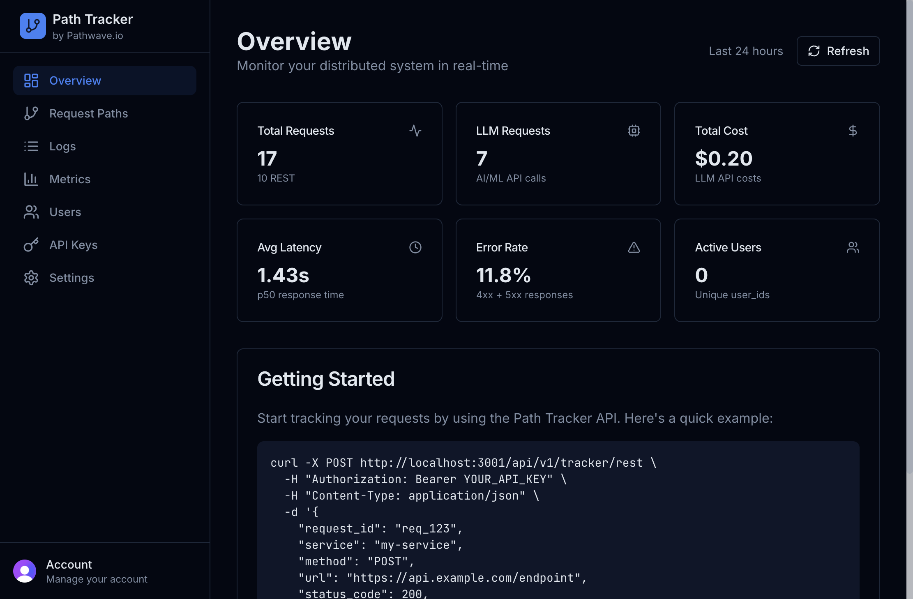
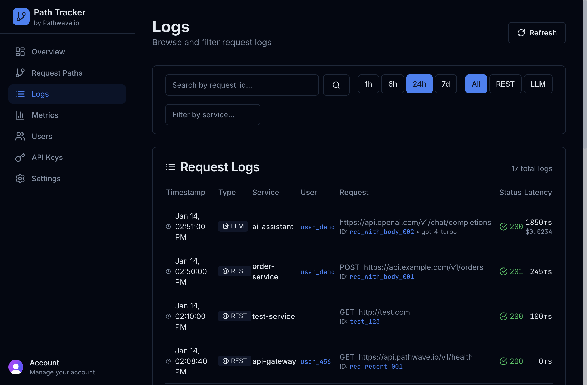
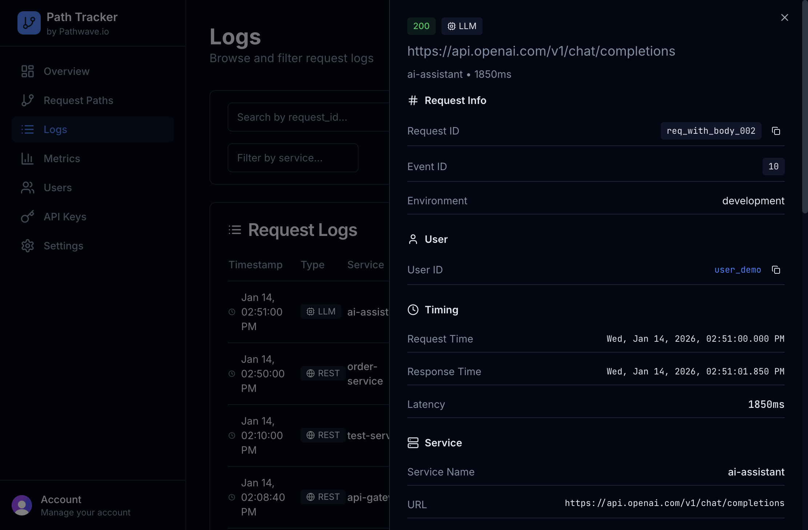
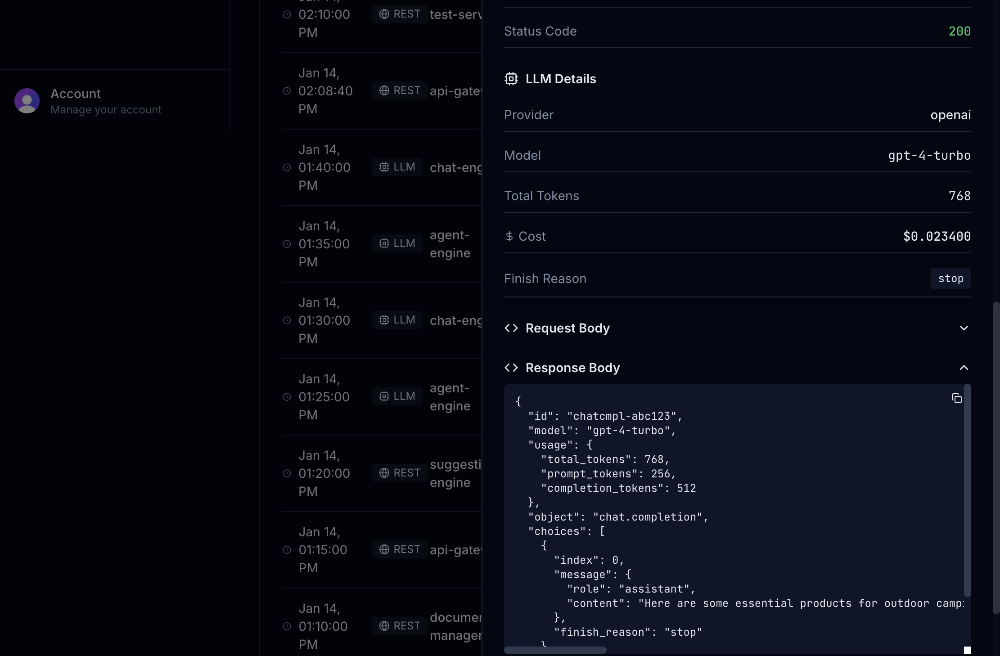
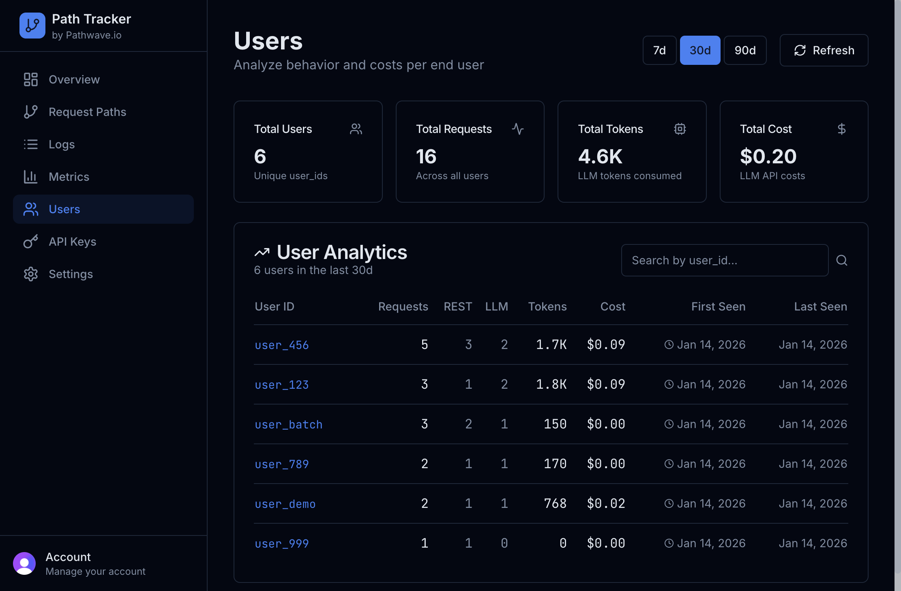
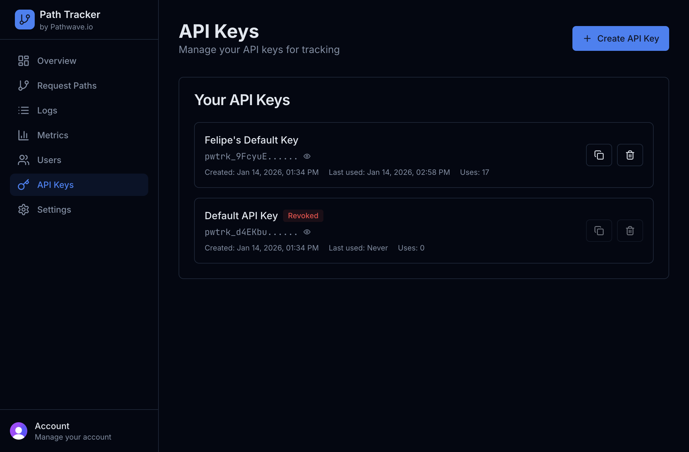
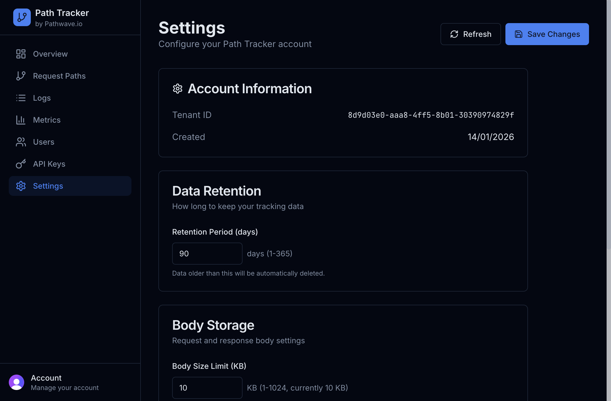

# Path Tracker UI Guide

Path Tracker provides a comprehensive dashboard for monitoring and analyzing your distributed system's requests, including both REST API calls and LLM (AI/ML) interactions.

## Overview Dashboard

The **Overview** page is your command center. At a glance, you can see:

- **Total Requests**: Combined count of REST and LLM requests tracked
- **LLM Requests**: Number of AI/ML API calls (OpenAI, Anthropic, etc.)
- **Total Cost**: Cumulative LLM API costs across all tracked requests
- **Avg Latency**: p50 response time for your services
- **Error Rate**: Percentage of 4xx and 5xx responses
- **Active Users**: Unique `user_id` values seen in the selected time range

The **Getting Started** section provides a quick cURL example to begin tracking requests immediately.

---

## Request Logs

The **Logs** page displays all tracked requests with powerful filtering capabilities:

### Filters
- **Time Range**: 1h, 6h, 24h, or 7d views
- **Type**: All, REST, or LLM requests
- **Service**: Filter by service name
- **Request ID / User ID**: Search for specific requests or users

### Log Entry Details

Each row shows:
- **Timestamp**: When the request occurred
- **Type**: REST or LLM badge
- **Service**: The originating service
- **User**: The user ID (clickable to filter)
- **Request**: URL, method, and request ID (clickable to filter)
- **Status**: HTTP status code with color coding
- **Latency**: Response time in milliseconds

### Request Detail Panel

Click on any row to open a detailed side panel showing:

- **Request Info**: Request ID, Event ID, Environment
- **User**: User ID with quick filter/copy options
- **Timing**: Request/response timestamps and latency
- **Service Details**: Service name, method, URL, status code

For LLM requests, additional fields include:

- **LLM Details**: Provider, model, token counts, cost, finish reason
- **Request Body**: The actual request payload (expandable JSON)
- **Response Body**: The response payload (expandable JSON with copy button)

---

## Request Paths

The **Request Paths** page visualizes how a single request flows through your distributed system:

1. Enter a `request_id` in the search box
2. See a timeline of all REST and LLM calls made during that request
3. Trace the complete path across multiple services

This is invaluable for debugging distributed transactions and understanding service dependencies.

---

## Metrics

The **Metrics** page provides aggregated analytics:

### Summary Cards
- Total Requests (REST + LLM breakdown)
- Total Tokens consumed
- LLM Cost
- p95 Latency

### REST API Metrics
- **Latency Percentiles**: p50, p95, p99
- **By Service**: Request counts per service
- **By Status Code**: Distribution of response codes (200, 201, 404, 500, etc.)

### LLM API Metrics
- Latency Percentiles
- By Provider (OpenAI, Anthropic, etc.)
- By Model (gpt-4-turbo, claude-3, etc.)

---

## Users

The **Users** page provides per-user analytics:

### Summary Cards
- Total unique users
- Total requests across all users
- Total tokens consumed
- Total LLM costs

### User Table
- **User ID**: Click to view all logs for this user
- **Requests**: Total request count
- **REST / LLM**: Breakdown by request type
- **Tokens**: Total tokens consumed
- **Cost**: Total LLM spend
- **First/Last Seen**: Activity timeline

Use the search box to find specific users by ID.

---

## API Keys

The **API Keys** page manages authentication for your tracking integrations:

### Features
- **Create API Key**: Generate new keys with custom names
- **View Keys**: See all active and revoked keys
- **Copy**: One-click copy for easy integration
- **Reveal/Hide**: Toggle key visibility
- **Revoke**: Disable keys that are no longer needed

Each key shows:
- Key name
- Key prefix (e.g., `pwtrk_9FcyuE...`)
- Creation date
- Last used timestamp
- Usage count

---

## Settings

The **Settings** page configures your Path Tracker account:

### Account Information
- **Tenant ID**: Your unique organization identifier
- **Created**: Account creation date

### Data Retention
- **Retention Period**: How long to keep tracking data (1-365 days)
- Data older than this period is automatically deleted

### Body Storage
- **Body Size Limit**: Maximum size for request/response body storage
- Larger bodies will be truncated

### Privacy
- **PII Scrubbing**: When enabled, sensitive data like emails and API keys are automatically redacted

### Budget
- **Monthly Budget**: Set a spending limit for LLM costs
- Alerts trigger when approaching this threshold

---

## Navigation

The sidebar provides quick access to all sections:

| Icon | Section | Description |
|------|---------|-------------|
| 📊 | Overview | Dashboard summary |
| 🔀 | Request Paths | Trace distributed requests |
| 📋 | Logs | Browse all requests |
| 📈 | Metrics | Aggregated analytics |
| 👥 | Users | Per-user analytics |
| 🔑 | API Keys | Manage API keys |
| ⚙️ | Settings | Account configuration |

---

## Tips & Tricks

### Quick Filtering
- Click any **User ID** in the logs to instantly filter by that user
- Click any **Request ID** to filter by that specific request
- Use these filters in combination with time ranges for precise analysis

### Keyboard Shortcuts
- **Escape**: Close the detail panel
- **F8**: Access notifications

### Best Practices
1. Use meaningful `request_id` values (e.g., `order_123_payment`) for easier debugging
2. Include `user_id` in all requests for user-level analytics
3. Set appropriate retention periods to manage storage costs
4. Review metrics regularly to identify performance bottlenecks
